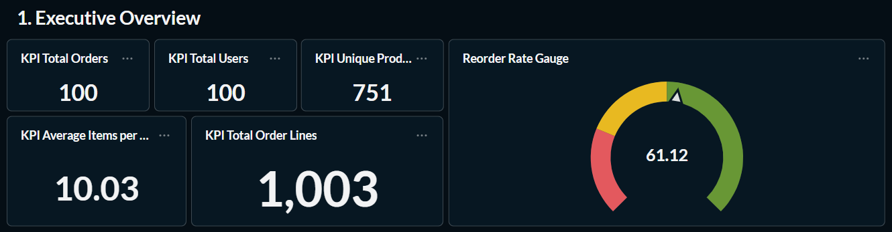
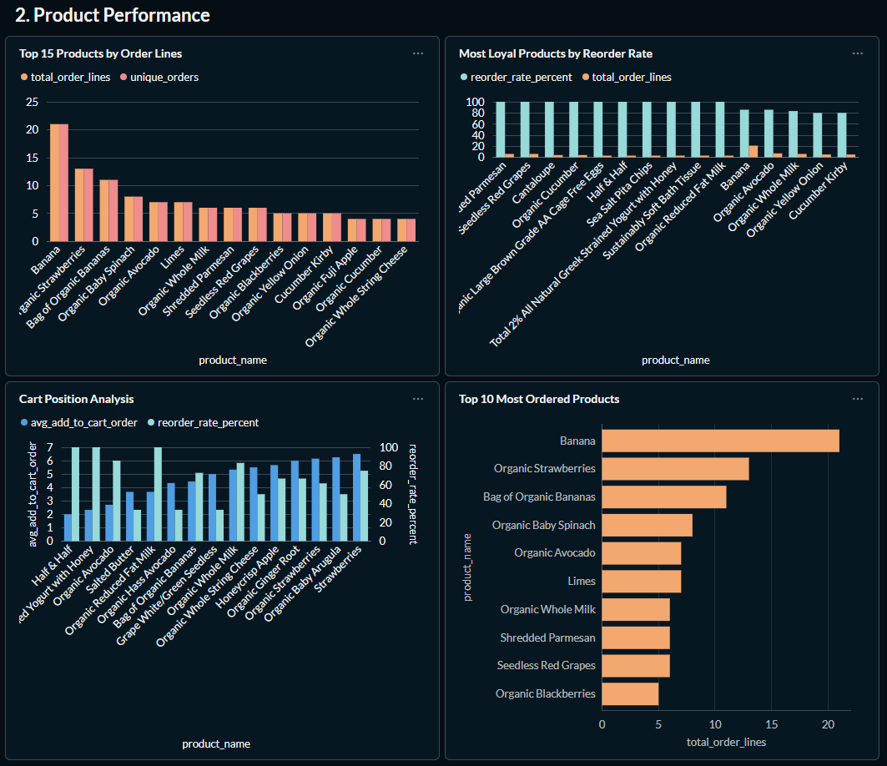
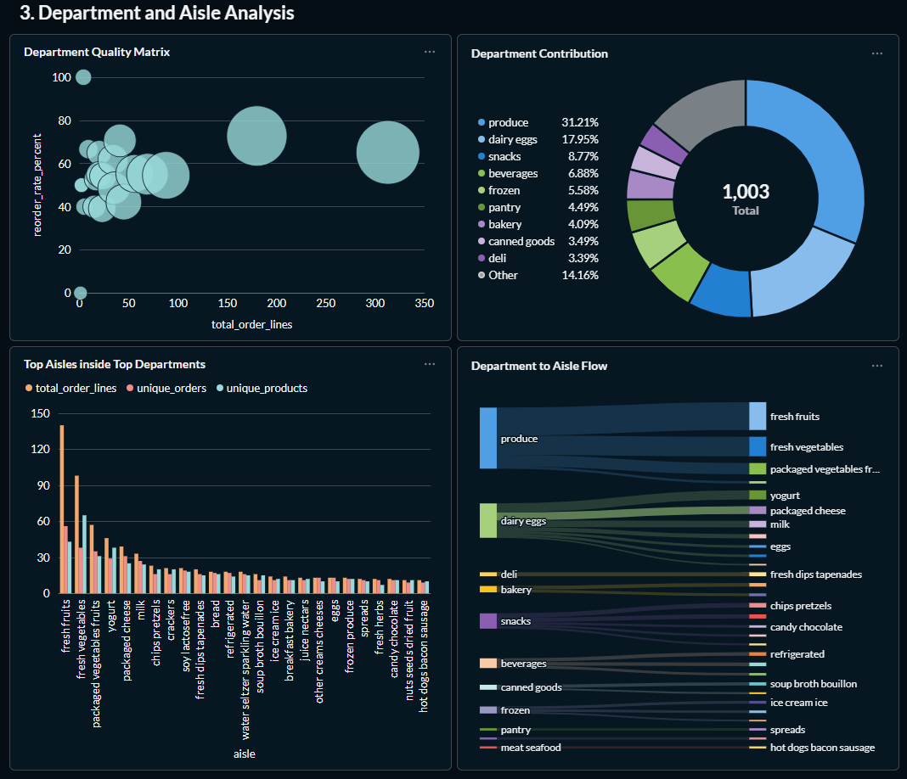
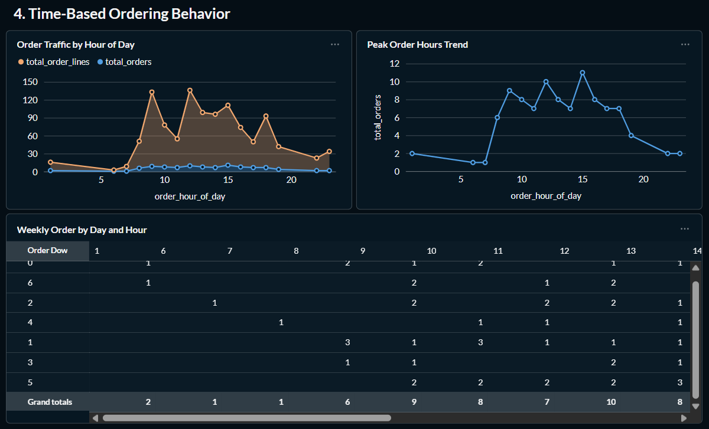
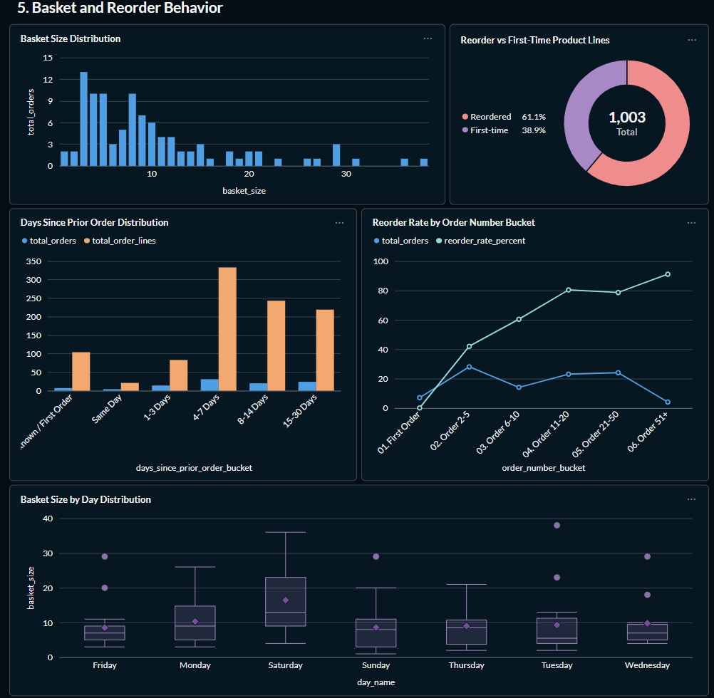

# MCI2026 Task 2 Kelompok 9 - E-Commerce Orders Data Pipeline
|Nama|NRP|
|-|-|
|Fazle Mawla Wahyuhanda|5054241020|
|Annisa Zahra Fitria|5053241040|

Repository ini dibuat untuk **Penugasan Ke-2 Modul 2 & 3**: Pipeline Orchestration dan Data Visualization menggunakan **Apache Airflow**, **PySpark**, **ClickHouse**, dan **Metabase**.

Dataset utama yang digunakan:

```text
http://96.9.212.102:8000/orders
```

Data dari API berbentuk nested JSON. Setiap order memiliki atribut utama seperti `order_id`, `user_id`, `order_number`, `order_dow`, `order_hour_of_day`, `days_since_prior_order`, `eval_set`, serta array `products` yang berisi detail produk dalam order tersebut.

> Catatan: pipeline Wikipedia lama tetap ada di folder `dags/scripts_wikped`, tetapi fokus tugas ini adalah pipeline Orders.

## Tujuan Project

Project ini mengerjakan tahapan berikut:

1. Merancang DAG Apache Airflow untuk pipeline Orders.
2. Mengambil data nested JSON dari API Orders.
3. Melakukan flatten data menjadi format tabular.
4. Menyimpan data sementara ke Data Lake dalam format Parquet.
5. Memproses data menggunakan PySpark.
6. Membuat database dan tabel di ClickHouse.
7. Meload data hasil pipeline ke ClickHouse.
8. Membuat SQL untuk DDL dan Metabase Questions.
9. Membuat visualisasi dan dashboard di Metabase.

## Tech Stack

| Komponen | Teknologi |
|----------|-----------|
| Orchestration | Apache Airflow 2.9 |
| Processing | Apache Spark / PySpark 3.5 |
| Data Warehouse | ClickHouse |
| Data Visualization | Metabase |
| Infrastructure | Docker Compose |
| Language | Python 3.11 |
| File Format | Parquet |

## Arsitektur Pipeline

```text
Orders API
    |
    v
fetch_orders.py
    |
    v
Data Lake: /opt/airflow/data_lake/orders/*.parquet
    |
    v
process_orders.py using PySpark
    |
    v
ClickHouse database: analytics
    |
    v
Metabase Questions and Dashboard

Orchestration: orders_ecommerce_pipeline DAG in Airflow
```

## Struktur Repository

```text
MCI2026_Task2_Kelompok9/
|-- dags/
|   |-- scripts_orders/
|   |   |-- fetch_orders.py
|   |   |-- process_orders.py
|   |   `-- orders_pipeline.py
|   `-- scripts_wikped/
|       |-- fetch_wikipedia_stream.py
|       |-- process_wikipedia_spark.py
|       `-- wikipedia_pipeline.py
|-- data_lake/
|-- docs/
|   `-- metabase_dashboard_plan.md
|-- sql/
|   `-- orders_clickhouse_metabase.sql
|-- docker-compose.yml
|-- Dockerfile
|-- requirements.txt
`-- README.md
```

## Komponen Pipeline Orders

| File | Fungsi |
|------|--------|
| `dags/scripts_orders/orders_pipeline.py` | Mendefinisikan DAG Airflow `orders_ecommerce_pipeline`. |
| `dags/scripts_orders/fetch_orders.py` | Mengambil data dari Orders API, flatten nested JSON, dan menyimpan hasilnya sebagai Parquet. |
| `dags/scripts_orders/process_orders.py` | Membaca Parquet dengan PySpark, membuat tabel ClickHouse, mengisi data, dan membersihkan Parquet yang sudah diproses. |
| `sql/orders_clickhouse_metabase.sql` | Berisi DDL ClickHouse dan query untuk Metabase Questions. |
| `docs/metabase_dashboard_plan.md` | Rencana visualisasi, axis, metrics, dan layout dashboard Metabase. |

## Menjalankan Project

Build image:

```bash
docker compose build
```

Inisialisasi database Airflow:

```bash
docker compose up airflow-init
```

Menjalankan semua service:

```bash
docker compose up -d
```

Akses service:

| Service | URL | Username | Password |
|---------|-----|----------|----------|
| Airflow | http://localhost:8080 | `admin` | `admin` |
| Metabase | http://localhost:3000 | dibuat saat setup | dibuat saat setup |
| ClickHouse HTTP | http://localhost:8123 | `admin` | `rahasia` |
| ClickHouse TCP | localhost:9000 | `admin` | `rahasia` |

Matikan service:

```bash
docker compose down
```

> Jangan gunakan `docker compose down -v` jika tidak ingin volume database ikut terhapus.

## Menjalankan DAG di Airflow

1. Buka Airflow di `http://localhost:8080`.
2. Login menggunakan `admin` / `admin`.
3. Cari DAG bernama `orders_ecommerce_pipeline`.
4. Aktifkan toggle DAG.
5. Klik `Trigger DAG`.

Urutan task:

```text
fetch_orders -> process_orders_spark
```

Penjelasan task:

- `fetch_orders`: mengambil data API Orders dan menyimpan file Parquet di Data Lake.
- `process_orders_spark`: membaca Parquet, memproses data dengan PySpark, membuat tabel ClickHouse jika belum ada, lalu insert data ke ClickHouse.

## ClickHouse Database dan Tabel

Database yang digunakan:

```sql
analytics
```

Tabel yang dibuat pipeline:

| Tabel | Fungsi |
|-------|--------|
| `analytics.orders_order_items` | Tabel detail hasil flatten. Satu baris merepresentasikan satu produk dalam satu order. |
| `analytics.orders_product_summary` | Tabel agregasi performa produk. |
| `analytics.orders_department_summary` | Tabel agregasi department. |
| `analytics.orders_hourly_summary` | Tabel agregasi pola order berdasarkan hari dan jam. |

DDL lengkap dan query Metabase tersedia di:

```text
sql/orders_clickhouse_metabase.sql
```

Pembuatan tabel dilakukan otomatis di dalam task `process_orders_spark` menggunakan `CREATE DATABASE IF NOT EXISTS` dan `CREATE TABLE IF NOT EXISTS`. File SQL tetap disediakan sebagai dokumentasi schema dan referensi query.

## Validasi Data ClickHouse

Masuk ke ClickHouse:

```bash
docker compose exec clickhouse-server clickhouse-client --user admin --password rahasia
```

Cek tabel:

```sql
SHOW TABLES FROM analytics LIKE 'orders%';
```

Cek jumlah baris:

```sql
SELECT 'orders_order_items' AS table_name, count() AS total_rows
FROM analytics.orders_order_items
UNION ALL
SELECT 'orders_product_summary', count()
FROM analytics.orders_product_summary
UNION ALL
SELECT 'orders_department_summary', count()
FROM analytics.orders_department_summary
UNION ALL
SELECT 'orders_hourly_summary', count()
FROM analytics.orders_hourly_summary;
```

Hasil validasi data saat README ini ditulis:

| Tabel | Jumlah Baris |
|-------|--------------|
| `orders_order_items` | 1003 |
| `orders_product_summary` | 100 |
| `orders_department_summary` | 21 |
| `orders_hourly_summary` | 66 |

## Setup Metabase

1. Buka `http://localhost:3000`.
2. Buat akun Metabase.
3. Pilih `Add your data`.
4. Gunakan koneksi ClickHouse berikut:

| Field | Value |
|-------|-------|
| Database type | ClickHouse |
| Display name | Orders Analytics Warehouse |
| Host | `clickhouse-server` |
| Port | `8123` |
| Database name | `analytics` |
| Username | `admin` |
| Password | `rahasia` |

Setelah koneksi berhasil, buat Questions menggunakan query pada file:

```text
sql/orders_clickhouse_metabase.sql
```

## Metabase Questions

Daftar Questions utama yang disiapkan untuk dashboard:

| ID | Nama Question | Visualisasi | Axis / Dimension | Metrics |
|----|---------------|-------------|------------------|---------|
| Q1A | Total Orders | Number | - | `total_orders` |
| Q1B | Total Users | Number | - | `total_users` |
| Q1C | Total Order Lines | Number | - | `total_order_lines` |
| Q1D | Unique Products | Number | - | `total_unique_products` |
| Q1E | Average Items per Order | Number | - | `avg_items_per_order` |
| Q16 | Reorder Rate Gauge | Gauge | Scale 0-100 | `reorder_rate_percent` |
| Q2 | Top Products | Bar | `product_name` | `total_order_lines`, `unique_orders` |
| Q3 | Most Loyal Products | Bar / Table | `product_name` | `reorder_rate_percent`, `total_order_lines` |
| Q4 | Department Contribution | Pie | `department` | `total_order_lines` |
| Q5 | Department Quality Matrix | Scatter | X: `total_order_lines` | Y: `reorder_rate_percent`, bubble: `unique_products` |
| Q6 | Order Traffic by Hour | Line / Area | `order_hour_of_day` | `total_orders`, `total_order_lines` |
| Q7 | Weekly Order by Day and Hour | Table / Bar | `day_name`, `order_hour_of_day` | `total_orders`, `total_order_lines`, `avg_items_per_order` |
| Q8 | Basket Size Distribution | Bar | `basket_size` | `total_orders` |
| Q9 | Reorder vs First-Time | Pie / Bar | `product_line_type` | `total_order_lines`, `percentage` |
| Q10 | Reorder Rate by Order Number | Line | `order_number_bucket` | `reorder_rate_percent`, `total_orders` |
| Q11 | Days Since Prior Order | Bar | `days_since_prior_order_bucket` | `total_orders`, `reorder_rate_percent` |
| Q12 | Top Aisles | Table / Bar | `aisle` | `total_order_lines`, `unique_orders`, `unique_products` |
| Q13 | Cart Position Analysis | Bar | `product_name` | `avg_add_to_cart_order`, `reorder_rate_percent` |
| Q14 | User Order Frequency Snapshot | Table / Bar | `user_id` | `total_orders`, `total_order_lines`, `avg_items_per_order` |
| Q15 | Data Freshness | Detail / Table | - | `latest_ingested_at` |
| Q17 | Department to Aisle Flow | Sankey | Source: `department`, target: `aisle` | `total_order_lines` |
| Q18 | Basket Size by Day | Box Plot | `day_name` | `basket_size` |
| Q19 | Peak Order Hours Trend | Line | `order_hour_of_day` | `total_orders` |
| Q20 | Top 10 Most Ordered Products | Row / Bar | `product_name` | `total_order_lines` |

> Catatan Metabase: `Pivot Table` hanya tersedia untuk Questions yang dibuat menggunakan Query Builder, bukan Native SQL. Karena itu Q7 dari SQL direkomendasikan sebagai `Table` atau `Bar`.

## Dashboard Design dan Insight

Dashboard disusun menjadi beberapa row agar alur analisis mudah dibaca: mulai dari ringkasan bisnis, performa produk, kategori, waktu order, sampai perilaku basket dan reorder.

Angka insight di bawah berasal dari snapshot ClickHouse terbaru pada 2026-05-18 15:40:23. Nilainya dapat berubah ketika DAG dijalankan ulang karena API Orders dapat menghasilkan batch data yang berbeda.

### Row 1 - Executive Overview

Query referensi: Q1A-Q1F.

Visualisasi:

- `Number`: Total Orders
- `Number`: Total Users
- `Number`: Total Order Lines
- `Number`: Unique Products
- `Number`: Average Items per Order
- `Gauge`: Reorder Rate

Fungsi row:

Row ini berfungsi sebagai executive snapshot. Pengguna bisa langsung melihat skala batch, jumlah user yang masuk, dan seberapa besar porsi repeat purchase tanpa membaca grafik detail terlebih dahulu.

Hasil data saat ini:

| Metric | Nilai |
|--------|-------|
| Total Orders | 100 |
| Total Users | 100 |
| Total Order Lines | 1003 |
| Unique Products | 751 |
| Average Items per Order | 10.03 |
| Reorder Rate | 61.12% |

Insight:

Batch terbaru memproses 100 order unik dari 100 user unik dengan 1003 order lines dan 751 unique products. Rata-rata 10.03 items per order menunjukkan basket yang cukup padat, sementara reorder rate 61.12% menandakan repeat purchase masih dominan pada snapshot ini.

Screenshot:



### Row 2 - Product Performance

Query referensi: Q2, Q3, Q13, Q20.

Visualisasi:

- `Bar`: Top Products by Order Lines
- `Bar` atau `Table`: Most Loyal Products by Reorder Rate
- `Bar`: Cart Position Analysis
- `Row` atau `Bar`: Top 10 Most Ordered Products

Fungsi row:

Row ini digunakan untuk membedakan produk yang paling sering muncul di basket dengan produk yang paling kuat repeat purchase-nya. Jadi, kita bisa melihat mana produk populer, mana produk loyal, dan mana yang biasanya masuk cart lebih awal.

Hasil data saat ini:

| Produk Teratas | Department | Order Lines | Reorder Rate |
|----------------|------------|-------------|--------------|
| Banana | produce | 21 | 85.71% |
| Organic Strawberries | produce | 13 | 61.54% |
| Bag of Organic Bananas | produce | 11 | 72.73% |
| Organic Baby Spinach | produce | 8 | 62.50% |
| Organic Avocado | produce | 7 | 85.71% |

Produk dengan reorder rate tinggi:

| Produk | Department | Order Lines | Reorder Rate |
|--------|------------|-------------|--------------|
| Seedless Red Grapes | produce | 6 | 100.00% |
| Shredded Parmesan | dairy eggs | 6 | 100.00% |
| Organic Cucumber | produce | 4 | 100.00% |
| Cantaloupe | produce | 4 | 100.00% |
| Organic Reduced Fat Milk | dairy eggs | 3 | 100.00% |

Insight:

Produk kategori `produce` tetap mendominasi daftar produk paling banyak dipesan. `Banana` menjadi produk paling populer dengan 21 order lines, sementara loyalitas tertinggi terlihat pada staples seperti `Seedless Red Grapes`, `Shredded Parmesan`, dan `Organic Reduced Fat Milk` yang semuanya mencapai reorder rate 100%.

Analisis cart position menunjukkan bahwa produk seperti `Half & Half` dan `Total 2% All Natural Greek Strained Yogurt with Honey` cenderung masuk cart lebih awal. Ini biasanya mengindikasikan kebutuhan rutin atau high-intent items, terutama di kategori dairy eggs.

Screenshot:



### Row 3 - Department and Aisle Analysis

Query referensi: Q4, Q5, Q12, Q17.

Visualisasi:

- `Pie`: Department Contribution
- `Scatter`: Department Quality Matrix
- `Table` atau `Bar`: Top Aisles inside Top Departments
- `Sankey`: Department to Aisle Flow

Fungsi row:

Row ini digunakan untuk melihat kontribusi kategori besar dan drill-down ke aisle yang benar-benar mendorong volume. Department memberi gambaran level tinggi, sedangkan aisle membantu melihat detail perilaku belanja.

Hasil department saat ini:

| Department | Order Lines | Share | Reorder Rate |
|------------|-------------|-------|--------------|
| produce | 313 | 31.21% | 65.18% |
| dairy eggs | 180 | 17.95% | 72.78% |
| snacks | 88 | 8.77% | 54.55% |
| beverages | 69 | 6.88% | 55.07% |
| frozen | 56 | 5.58% | 55.36% |

Top aisle saat ini:

| Department | Aisle | Order Lines | Reorder Rate |
|------------|-------|-------------|--------------|
| produce | fresh fruits | 140 | 65.71% |
| produce | fresh vegetables | 98 | 65.31% |
| produce | packaged vegetables fruits | 57 | 64.91% |
| dairy eggs | yogurt | 46 | 63.04% |
| dairy eggs | packaged cheese | 39 | 61.54% |

Insight:

Department `produce` masih menjadi penyumbang volume terbesar, dan jika digabung dengan `dairy eggs` dua kategori ini sudah mencakup 49.16% dari seluruh order lines. Menariknya, `dairy eggs` justru punya reorder rate paling tinggi di antara top department, jadi kategori ini bukan cuma besar tetapi juga kuat di repeat purchase.

Dari sisi aisle, `fresh fruits` dan `fresh vegetables` menjadi dua aisle terbesar. Ini menunjukkan kebutuhan harian seperti buah dan sayur tetap mendominasi snapshot sekarang, dengan `fresh fruits` sebagai aisle volume utama.

Screenshot:



### Row 4 - Time-Based Ordering Behavior

Query referensi: Q6, Q7, Q19.

Visualisasi:

- `Line` atau `Area`: Order Traffic by Hour
- `Table` atau `Bar`: Weekly Order by Day and Hour
- `Line`: Peak Order Hours Trend

Fungsi row:

Row ini digunakan untuk melihat pola waktu order. Informasi ini berguna untuk mengetahui jam sibuk, hari dengan traffic tertinggi, dan slot waktu yang paling padat untuk promo atau operasional.

Hasil jam order saat ini:

| Jam Order | Total Orders | Total Order Lines | Avg Items per Order |
|-----------|--------------|-------------------|---------------------|
| 15 | 11 | 100 | 9.09 |
| 12 | 10 | 126 | 12.60 |
| 9 | 9 | 124 | 13.78 |
| 13 | 8 | 91 | 11.38 |
| 10 | 8 | 70 | 8.75 |

Hasil hari order saat ini:

| Hari | Total Orders | Total Order Lines | Avg Items per Order |
|------|--------------|-------------------|---------------------|
| Sunday | 20 | 172 | 8.60 |
| Monday | 18 | 186 | 10.33 |
| Friday | 17 | 145 | 8.53 |
| Tuesday | 16 | 149 | 9.31 |
| Saturday | 11 | 181 | 16.45 |

Insight:

Jam tersibuk pada batch ini adalah pukul 15 dengan 11 orders, disusul pukul 12 dengan 10 orders dan pukul 9 dengan 9 orders. Secara umum, traffic terkonsentrasi di rentang 9-16, jadi waktu siang menuju sore masih menjadi pola utama order.

Dari sisi hari, `Sunday` memiliki total orders tertinggi, diikuti `Monday` dan `Friday`. Menariknya, `Saturday` memiliki average items per order paling tinggi, yaitu 16.45 item per order, sehingga hari dengan order lebih sedikit justru bisa menghasilkan basket yang jauh lebih besar.

Pada kombinasi hari-jam, slot terkuat ada di `Tuesday 15:00` dengan 4 orders dan 51 order lines. Ini menandakan ada momen spesifik pada mid-afternoon yang menjadi puncak traffic untuk snapshot sekarang.

Screenshot:



### Row 5 - Basket and Reorder Behavior

Query referensi: Q8, Q9, Q10, Q11, Q18.

Visualisasi:

- `Bar`: Basket Size Distribution
- `Pie` atau `Bar`: Reorder vs First-Time Product Lines
- `Line`: Reorder Rate by Order Number Bucket
- `Bar`: Days Since Prior Order Distribution
- `Box Plot`: Basket Size by Day Distribution

Fungsi row:

Row ini digunakan untuk memahami perilaku belanja pelanggan: seberapa besar keranjang belanja, berapa banyak produk yang dibeli ulang, bagaimana reorder berubah seiring frekuensi order pelanggan, dan bagaimana spread basket berbeda antar hari.

Hasil basket size saat ini:

| Basket Size | Total Orders |
|-------------|--------------|
| 3 | 13 |
| 4 | 10 |
| 5 | 10 |
| 8 | 10 |
| 9 | 7 |

Perbandingan reorder:

| Product Line Type | Total Order Lines | Percentage |
|-------------------|-------------------|------------|
| Reordered | 613 | 61.12% |
| First-time | 390 | 38.88% |

Reorder rate berdasarkan order number:

| Order Number Bucket | Total Orders | Reorder Rate |
|---------------------|--------------|--------------|
| First Order | 7 | 0.00% |
| Order 2-5 | 28 | 41.98% |
| Order 6-10 | 14 | 60.42% |
| Order 11-20 | 23 | 80.40% |
| Order 21-50 | 24 | 78.63% |
| Order 51+ | 4 | 91.11% |

Days since prior order:

| Days Since Prior Order Bucket | Total Orders | Reorder Rate |
|------------------------------|--------------|--------------|
| Unknown / First Order | 7 | 0.00% |
| Same Day | 4 | 66.67% |
| 1-3 Days | 14 | 59.04% |
| 4-7 Days | 31 | 79.58% |
| 8-14 Days | 20 | 64.20% |
| 15-30 Days | 24 | 58.90% |

Insight:

Basket size yang paling sering muncul adalah 3 item per order, dan mayoritas basket masih berada di rentang kecil-menengah. Meski begitu, ada juga beberapa basket besar di long tail, sehingga box plot tetap penting untuk melihat sebaran dan outlier antar hari.

Pola reorder meningkat seiring naiknya `order_number`. Pada first order, reorder rate 0% karena pelanggan belum memiliki histori pembelian sebelumnya. Setelah pelanggan mencapai order 11-20, reorder rate sudah menembus 80.40%, dan pada order 51+ mencapai 91.11%. Ini menunjukkan bahwa pelanggan yang lebih sering bertransaksi cenderung semakin banyak membeli produk yang sama kembali.

Pada distribusi `days_since_prior_order`, bucket 4-7 hari memiliki 31 orders dan reorder rate 79.58%. Ini mengindikasikan banyak repeat order terjadi dalam interval mingguan. Tidak ada bucket `30+ Days` pada snapshot ini, jadi pattern belanja lebih condong ke customer yang cukup aktif.

Screenshot:



### Footer - Data Freshness

Query referensi: Q15.

Visualisasi:

- `Detail` atau `Table`: Dashboard Refresh Timestamp

Fungsi row:

Bagian ini digunakan untuk validasi bahwa dashboard membaca snapshot terbaru dari pipeline, bukan data lama yang belum di-refresh.

Hasil data saat ini:

| Metric | Nilai |
|--------|-------|
| Latest Ingested At | 2026-05-18 15:40:23 |
| Earliest Ingested At | 2026-05-18 15:40:23 |
| Total Orders in Current Load | 100 |
| Total Order Lines in Current Load | 1003 |

Insight:

Seluruh row pada batch ini berasal dari timestamp ingest yang sama, jadi dashboard sedang membaca satu snapshot pipeline yang konsisten. Karena tabel agregat ditulis ulang dengan truncate-insert, angka yang tampil di Metabase akan selalu mengikuti run DAG terbaru.

